FlowerShop
-
- Full-features full-fledged production-grade eCommerce modern web application powered by Spring Boot and Angular

#### Requirements:
1. `JDK 11 (LTS)`
2. `Node 12.18.3 (LTS)`
3. `NPM 6.14.6`
4. `MySQL Server 8`
5. `IntelliJ IDEA`
6. `Postman or Insomnia`
7. `Maven` (for `Production Environment` only).

#### Development environment setup instruction:
1. Open root folder in `IntelliJ IDEA`.
2. Edit file `application.yml` (MySQL server's account and version) according to your database or setup environment variables.
3. Running the first 2 lines in file `db/run.sql` to create a database (schema) name `flowershop` in the MySQL Server. 
4. Launch Spring Boot `FlowershopApplication`. The tables will be create if run the first time.
5. Run the rest in file `db/run.sql` to fill default data for our application.
6. In `Postman`, call `POST` at `http://localhost:8080/api/test` with the `JSON body` copied from `db/mock-test.json`.
7. In `Postman`, call `POST` at `http://localhost:8080/api/product` with the `JSON body` copied from `db/product.json`.
8. Run `npm install` in `cmd` (or `terminal`) inside `frontend` folder.
9. Open `frontend/package.json` and click on the `green arrow` beside `start-dev` to run `frontend` in development mode.
10. Open browser at `http://localhost:4200` to access our application.

#### Production environment setup instruction:
1. Production environment needs only `JDK 11`, `Maven` and `MySQL Server 8` installed. Then setup `database` and `application.properties` properly as in `Development Environment`.
2. Run `mvn package` in `cmd` inside root folder. This will create a `Jar` package inside `target` folder named `flowershop-1.0.jar`.
3. Run this `Jar` package in `cmd` by this command `java -jar target/flowershop-1.0.jar`.
4. Access our application via an endpoint, for example an `AWS Cloud Endpoint`.

#### Some pictures:
1. Guess Site shop page
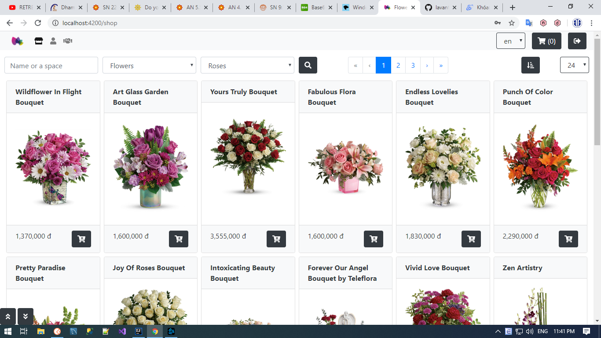
2. Guess Site shopping cart
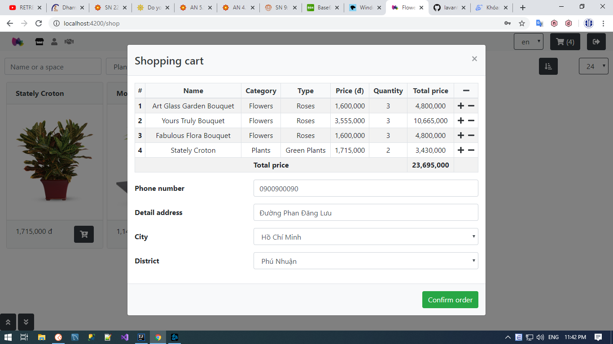
3. Member Site account details
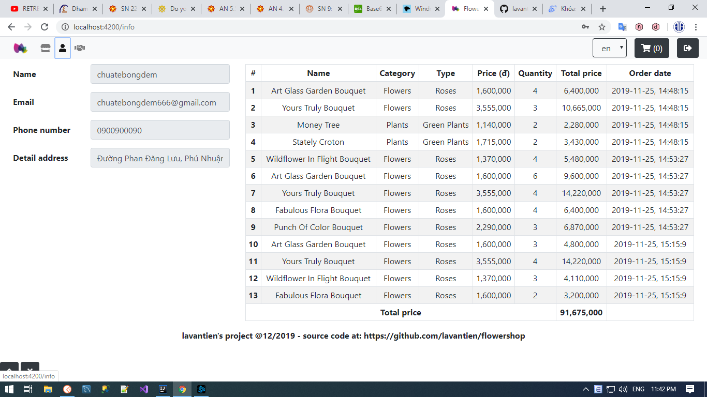
4. Admin Site products listing
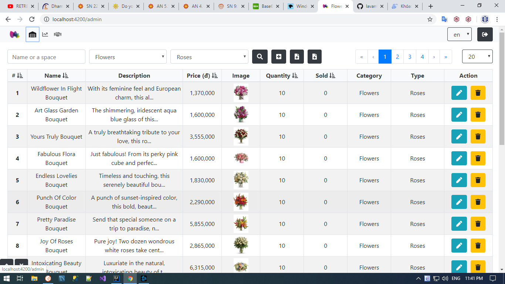
5. Admin Site transaction summary
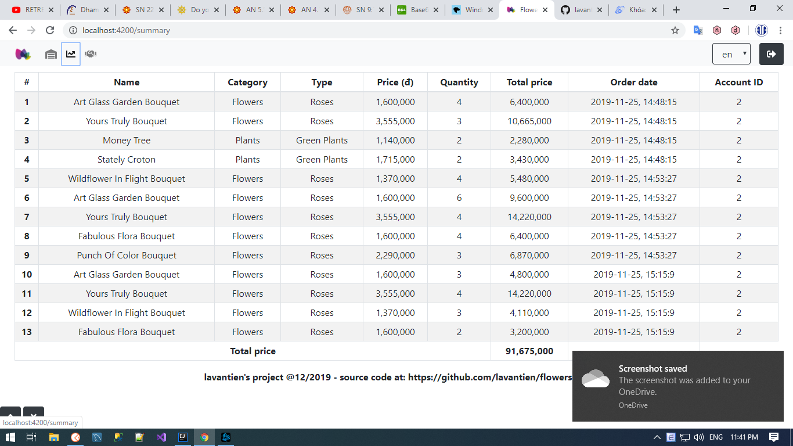
6. Admin Page create new product
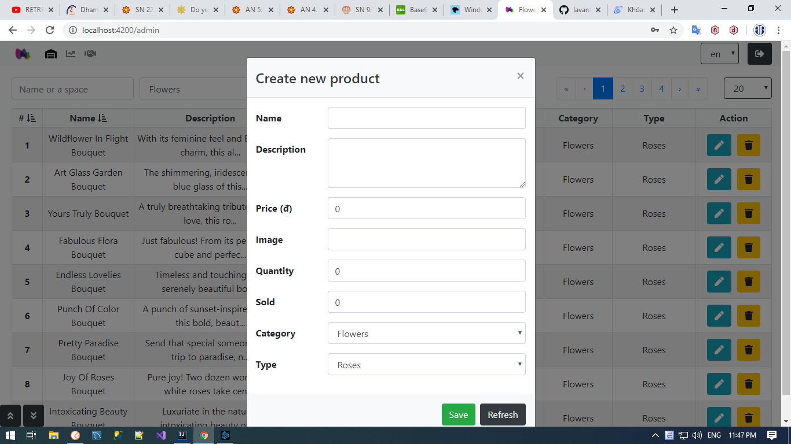
7. Admin Page import products from Excel
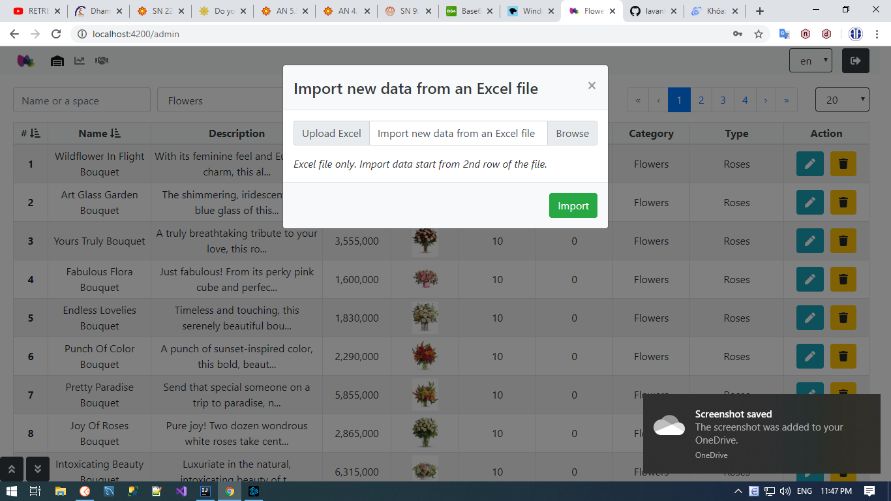
8. Admin Page export products to Excel
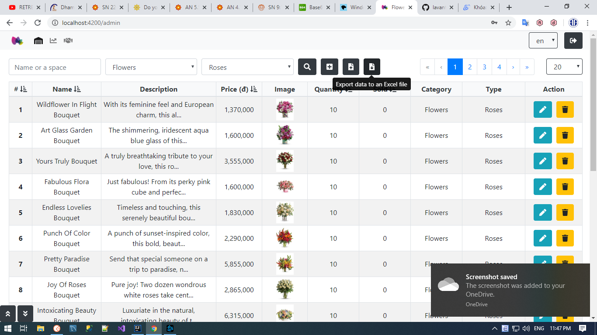
9. Admin Page edit product
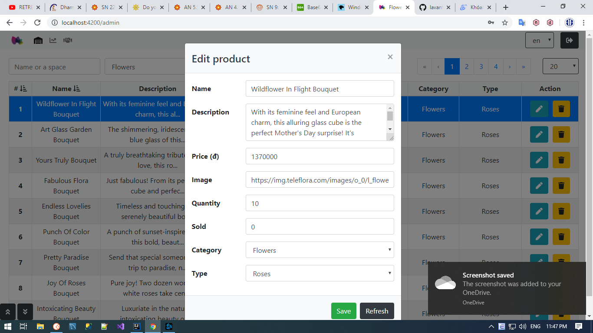
10. Admin Page batch delete
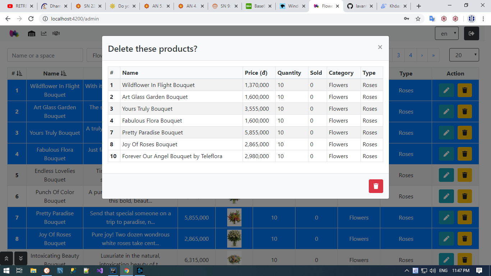
11. Product details displays when clicked
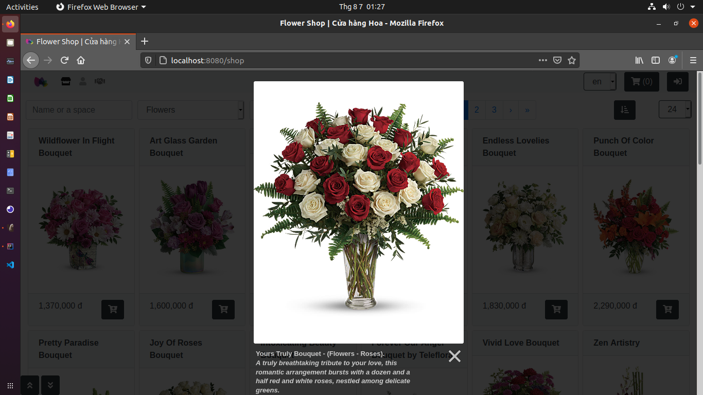

#### The latest build succeed (Aug 7th 2020):
```
[INFO] Results:
[INFO] 
[INFO] Tests run: 1, Failures: 0, Errors: 0, Skipped: 0
[INFO] 
[INFO] 
[INFO] --- maven-jar-plugin:3.2.0:jar (default-jar) @ flowershop ---
[INFO] Building jar: /home/lavantien/Documents/dev/flowershop/target/flowershop-1.1.jar
[INFO] 
[INFO] --- spring-boot-maven-plugin:2.3.2.RELEASE:repackage (repackage) @ flowershop ---
[INFO] Replacing main artifact with repackaged archive
[INFO] ------------------------------------------------------------------------
[INFO] BUILD SUCCESS
[INFO] ------------------------------------------------------------------------
[INFO] Total time:  44.918 s
[INFO] Finished at: 2020-08-07T00:57:12+07:00
[INFO] ------------------------------------------------------------------------
```